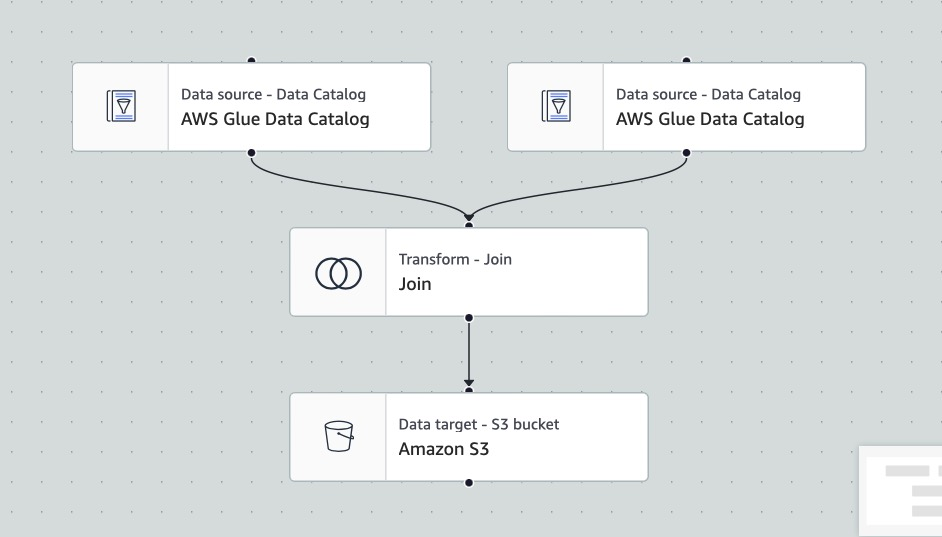

# End-to-End-YouTube-Data-Pipeline-with-AWS

*Figure: End-to-End AWS YouTube Data Pipeline Architecture - Illustrating data flow from ingestion to analytics.*

This project aims to securely manage, streamline, and analyze structured and semi-structured YouTube video data based on video categories and trending metrics.

---

## Project Goals

1. **Data Ingestion**  
   Build a mechanism to ingest data from different sources.

2. **ETL System**  
   Transform raw data into a structured and analytical-ready format.

3. **Data Lake**  
   Centralize structured and semi-structured data from multiple sources into a repository.

4. **Scalability**  
   Ensure the system scales as the size of data increases.

5. **Cloud-Based Architecture**  
   Leverage AWS to process vast amounts of data efficiently.

6. **Reporting**  
   Create a dashboard to analyze key metrics and answer business questions.

---

## Data Source

The data for this project is sourced from Kaggle. You can access it [here](https://www.kaggle.com/datasets/datasnaek/youtube-new).

---

## Architecture Overview

### Data Flow Summary

1. Data ingestion is performed using CLI commands located in the [file](/Users/Abdul/Desktop/End-to-End-YouTube-Data-Pipeline-with-AWS/cli_command.sh)

2. **Lambda** is used to process raw JSON files, transforming them into structured formats. These transformations are handled by a Lambda function that triggers whenever a new file is uploaded to the raw S3 bucket. The script is located [here](lambda_function.py)

3. **Glue** is used for further data transformation on the structured data (CSVs), leveraging a PySpark script located [here](Users/Abdul/Desktop/End-to-End-YouTube-Data-Pipeline-with-AWS/pyspark_code.py). This transformation ensures the proper data types in the schema, enabling seamless joins with the processed JSON data.

4. The pipeline uses three S3 buckets:  
   - **Raw**: Stores unprocessed data.  
   - **Cleansed**: Contains cleansed data.  
   - **Analytics**: Hosts the final transformed data ready for reporting. This way, there is no need for writing queries to join the data.

5. Glue's **Visual ETL** process prepares the data for analysis by joining the processed csv and processed json. The architecture for this process is shown below:  

     
   *Figure: Glue Visual ETL process for data transformation.*

6. The final step connects the **analytics-ready data** to QuickSight for dashboard generation.

---

## Dashboard Preview

*Figure: Dashboard generated from the pipeline with QuickSight.*

---

## Key Components

### AWS Services Used
- **S3**: For data storage (Raw, Cleansed, Analytics buckets).
- **AWS Lambda**: Event-driven transformations for incoming raw data.
- **AWS Glue**: ETL processing using PySpark and Visual ETL. Also organizes and classifies the data, ensuring discoverability and metadata management.
- **AWS IAM**: For access control and permissions.
- **AWS Athena**: AWS Athena enables SQL-based querying of processed data directly from the Analytics S3 bucket.
- **Amazon QuickSight**: Generate business insights via dashboards.
- **AWS CloudWatch**: Monitor and alert for pipeline performance.

---

## How It Works

1. **Ingestion**:  
   Raw data from Kaggle is uploaded to the Raw S3 bucket using CLI commands.

2. **Transformation**:  
   - **AWS Lambda** processes the raw JSON data, transforming it into structured format and moving it to the Cleansed S3 bucket.  
   - **AWS Glue PySpark** and Visual ETL further transform and prepare the data for analytics. The output is stored in the Analytics S3 bucket.

3. **Analytics**:  
   - Data is queried using AWS Athena and visualized using Amazon QuickSight.

4. **Monitoring**:  
   AWS CloudWatch is set up to monitor the system's performance and send alerts if needed.

---
